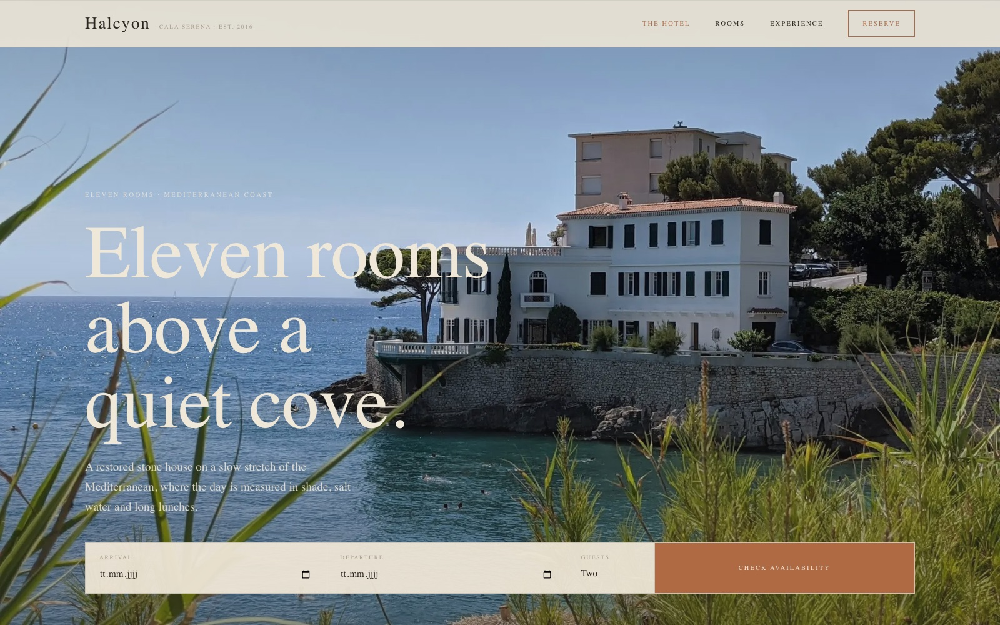
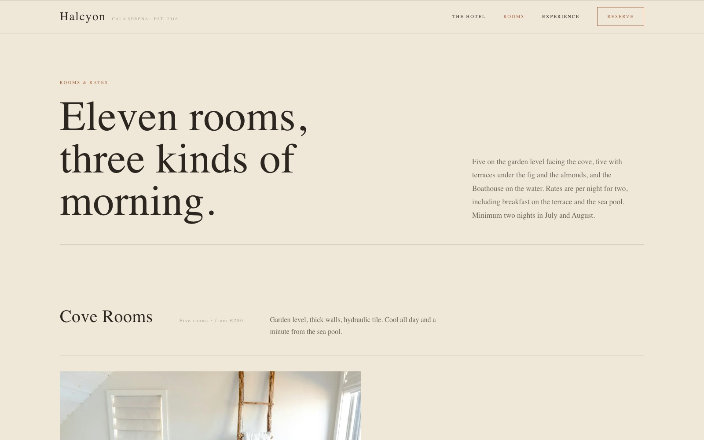
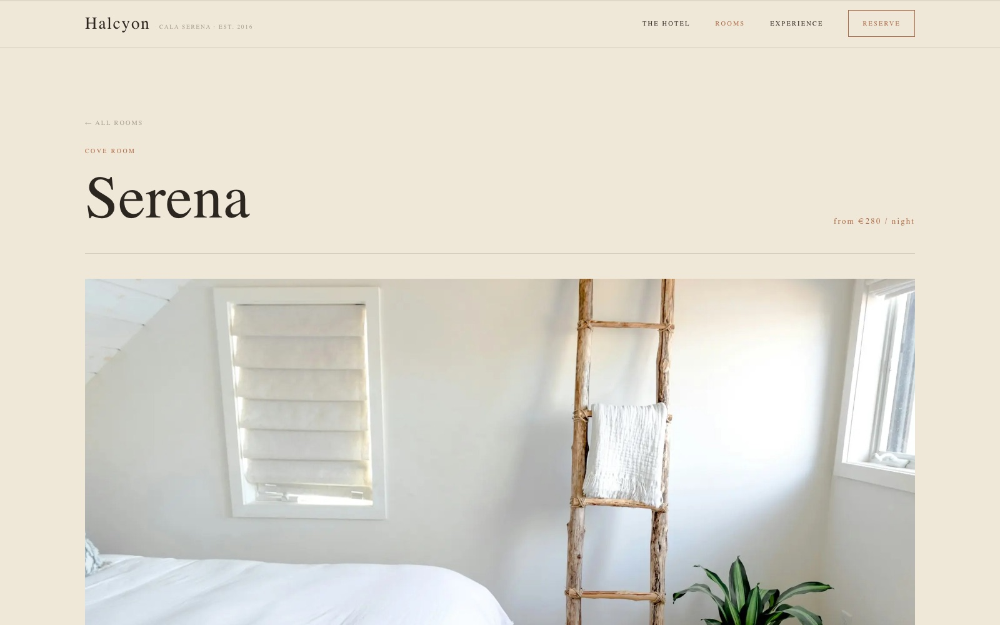

<div align="center">

# Halcyon

**A boutique-hotel website template — part of the [Templify](https://github.com/manusmd) collection.**

Warm, sun-washed, and built for a quiet cove. Next.js 16 and Lenis.



</div>

---

## Highlights

- 🏖️ **Five views** — the Hotel, Rooms, a Suite detail, Experience, and Reserve — with a soft cross-fade between them
- 🗓️ **Booking bar & reserve flow** — an inline availability bar and a full enquiry form with a “thank you” state (mock — no real payments)
- 🛏️ **Eleven rooms** — grouped into Cove Rooms, Terrace Suites and the Boathouse, each with its own suite page, sticky facts, and gallery
- 🗺️ **Experience** — dining, curated experiences, and a stylised “getting here” map
- ✨ **Warm motion** — hero parallax, clip-path suite reveal, reveal-on-scroll, a top progress bar
- 📱 **Proper mobile nav** — animated hamburger → full-screen olive menu with numbered items
- 🌿 **Limestone & olive design** — Cormorant Garamond + Jost + IBM Plex Mono, terracotta accent
- ♿ **Resilient** — fully **no-JS and reduced-motion safe** (content is never hidden behind an animation)
- 🧩 **Content-driven** — the whole site renders from one typed file, `lib/content.ts`
- 🌀 **Lenis smooth scroll** + a matching custom scrollbar, `next/image` throughout
- ⚡ **Static** — deploys to Vercel with zero configuration

## A closer look

| Rooms & rates | A suite |
| --- | --- |
|  |  |

## Getting started

```bash
npm install
npm run dev
```

Open [http://localhost:3000](http://localhost:3000).

## Editing content

Everything the site shows lives in one typed object: **`lib/content.ts`** — the hotel,
the eleven `suites`, experiences, rates, and contact. The Unsplash image IDs live in the
`IMG` map at the top of that file — swap them for your own photography.

## Deploy

Push to GitHub and import on [Vercel](https://vercel.com/new) — it's a static
Next.js site, nothing to configure.

## Structure

```
lib/content.ts            Site content + the eleven suites (typed, single source of truth)
app/App.tsx               View state, cross-fade, Lenis + parallax/reveal/progress loop
app/components/           Header (+ mobile menu), Views (Home/Rooms/Suite/Experience/Reserve), Img
```

## Tech

Next.js 16 · React 19 · TypeScript · Lenis · next/font · next/image

---

<div align="center">
<sub>A Templify template. Example photography via <a href="https://unsplash.com">Unsplash</a>. Booking is a mock — no real payments.</sub>
</div>
